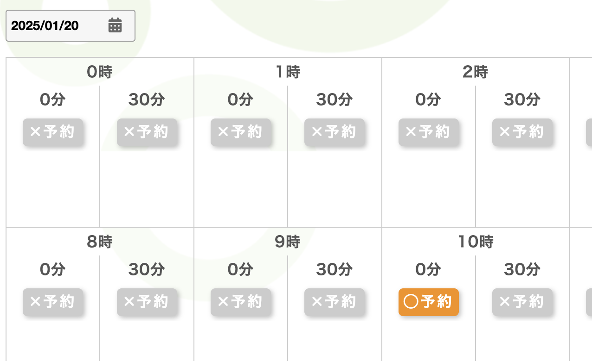

# fun_navi
fun naviの施設予約関連スクリプト

## 目次

1. [概要](#概要)
2. [環境](#環境)
3. [使い方](#使い方)
4. [ディレクトリ構成](#ディレクトリ構成)
5. [更新履歴](#更新履歴)

## 概要

このプロジェクトは、fun naviでの共用施設の空き情報や予約の自動化を実現するためのものです。某マンションの某街区で作成者が関心のある施設に限定し、かつ、限定的な環境での検証しかしていないため、fun navi全般や他者の環境での利用では何らかの問題がある可能があります。

### 何ができて何ができないか

①特定施設（パーティールーム）の２ヶ月先までの空き状況の取得及びcsv出力と②先日付の自分の予約結果の取得ができます。  
現時点では検索時に以下の画像のように表示されるパーティールーム以外の施設には対応していません（例：ゲストルーム）。また、空き状況や予約結果を抽出するのみで予約の自動化は対応していません。


## 環境
1. 検証環境  
- macOS Ventura
- python 3.13.1
- chrome driver mac-x64 131.0.6778.264
- selenium 4.27.1
で検証しています。手元にWindows環境がないため、以下はmacOSに限定して記載しますが、Windowsでも動くはず、知らんけど。

2. 前提となるソフトウェア
- <a href="https://developer.chrome.com/docs/chromedriver?hl=ja">ChromeDriver</a>
- Python 3.x


3. Pythonで利用するライブラリのinstall  

    仮想環境の作成、activate
    ```bash
    python3 -m venv .venv
    source .venv/bin/activate
    ```
    libraryのinstall
    ```bash
    python3 -m venv .venv
    pip install -r requirements.txt
    ```

4. 設定ファイル
`.env`に各種変数を記載します

    ### 環境変数の一覧

    | 変数名                 | 役割                                      |
    | ---------------------- | ----------------------------------------- |
    | CHROME_DRIVER_PATH    | ChromeDriverのパス |
    | LOGIN_URL         | fun naviのログインサイトのURL   |
    | USER_ID             | fun naviのログインuser id         |
    | PASSWORD         | fun naviのログインパスワード      |
    | FACILITY_NAMES             | 空き状況チェック対象の施設名 ※現在パーティルームのみ対応        |
    | PHONE_NUMBER             | 予約時に記入する緊急連絡先      |
    | SEARCH_START_DATE             | 空き状況検索開始日                |
    | SEARCH_END_DATE          | 空き状況検索終了日              |
    | HOLIDAYS_ONLY                  | 検索対象を日本の土日休日に限定する場合はtrueを指定                  |
    | EXCLUDED_DATES                  | 検索対象から除外する日程（追加より優先されます）                  |
    | ADDITIONAL_DATES                  | 検索対象に追加する日程                  |
    | LOG_LEVEL        | ログレベル                   |

## 使い方

1. 指定期間・指定施設の空き状況確認
    ```bash
    python3 fun_navi_availability_check.py
    ```
    `.env`で指定した期間・施設を対象に空き状況を確認し、csv形式で出力します。（`availability_matrix.csv`）

2. 予約状況の取得
    ```bash
    fun_navi_list_reservastion.py
    ```
    先日付の自分の予約をcsv形式で出力します。（`existing_reservations.csv`）

## ディレクトリ構成

```bash
.
├── LICENSE
├── README.md                           本ファイル
├── fun_navi_availability_check.py      空き状況チェック用スクリプト
├── fun_navi_common.py                  共通関数用スクリプト
├── fun_navi_list_reservation.py        自分の予約抽出用スクリプト
├── fun_navi_log.log                    実行ログ（削除してOK）
├── img                                 README向け画像置き場
│   └── partyroom.png                   
└── requirements.txt                    必要なパッケージ
```

## 更新履歴

* 2025/1/8: 公開

